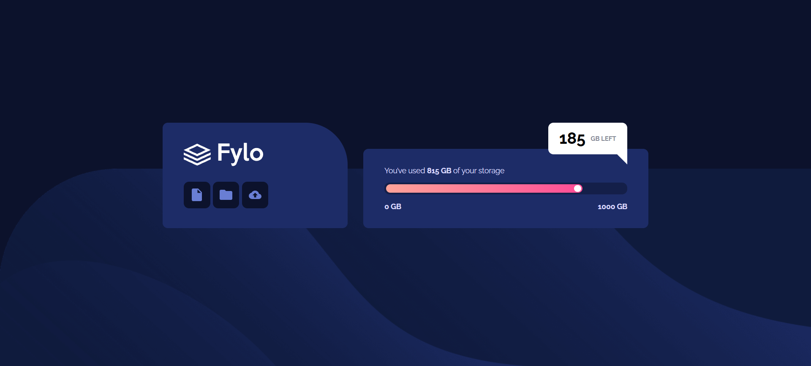

# Frontend Mentor - Fylo data storage component solution

This is a solution to the [Fylo data storage component challenge on Frontend Mentor](https://www.frontendmentor.io/challenges/fylo-data-storage-component-1dZPRbV5n). Frontend Mentor challenges help you improve your coding skills by building realistic projects.

## Table of contents

- [Overview](#overview)
  - [The challenge](#the-challenge)
  - [Screenshot](#screenshot)
  - [Links](#links)
- [My process](#my-process)
  - [Built with](#built-with)
  - [What I learned](#what-i-learned)
  - [Continued development](#continued-development)
  - [AI Collaboration](#ai-collaboration)

## Overview

### The challenge

Users should be able to:

- View the optimal layout for the site depending on their device's screen size
- See the storage bar fill according to the data provided, with the "GB left" tooltip positioned correctly

### Screenshot

Desktop



Mobile


### Links

- Live Site URL: https://lenka-limberkova.github.io/data-storage-component/

## My process

### Built with

- Semantic HTML5 markup
- CSS custom properties
- Flexbox
- CSS Grid
- Desktop-first workflow
- CSS media queries

### What I learned

This project helped me understand the difference between **fixed (pixel-based)** and **relative (percentage-based)** values, and when each one is the right choice.

The storage bar fill is a good example. At first, the filled part of the bar had a fixed pixel width, which meant it didn't actually represent the 815/1000 GB ratio - it was just a number that happened to look right at one specific screen size. Switching it to a percentage of its parent fixed that, since it now scales correctly no matter how wide the bar itself is:

```css
.slider-gradient {
  width: 81.5%;
}
```

I also learned how `background-position` percentages work differently than I expected - the percentage describes which point *on the image* lines up with the corresponding point *on the container*, not simply "where on the container the image goes."

For positioning the tooltip bubble, I learned that `top`/`right`/`bottom`/`left` only do anything once an element has a `position` value other than `static`, and that choosing between `top` and `bottom` (or `left` and `right`) should depend on which edge the element is conceptually anchored to - so it stays in the right place even if the parent's height changes between breakpoints.

For the responsive layout, going from desktop to mobile also meant remembering to reset properties that were set in the desktop rule but no longer apply (e.g. setting `top: auto;` when switching an absolutely positioned element to use `bottom` instead on mobile).

```css
@media (max-width: 768px) {
  .flag {
    top: auto;
    right: auto;
    bottom: -30px;
  }
}
```

### Continued development

- Get more comfortable choosing between Flexbox and Grid before starting a layout, instead of defaulting to Flexbox out of habit
- Practice writing media queries mobile-first, to compare how the workflow differs from the desktop-first approach used here
- Learn more about `clamp()` as a possible alternative to writing separate fixed values per breakpoint

### AI Collaboration

I used Claude as a learning assistant throughout this project - mainly for debugging CSS issues (like the storage bar alignment and background image positioning) and for explaining concepts like flexbox axes, the `position` property, and percentage-based sizing. Rather than getting finished code, I was guided with questions and explanations so I could work out the solutions myself.
